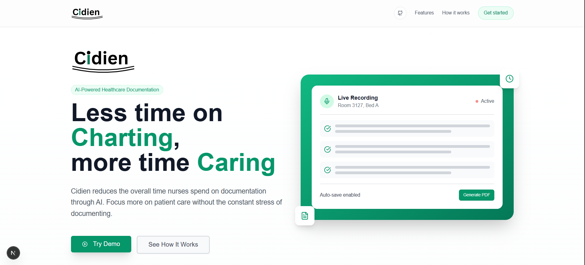
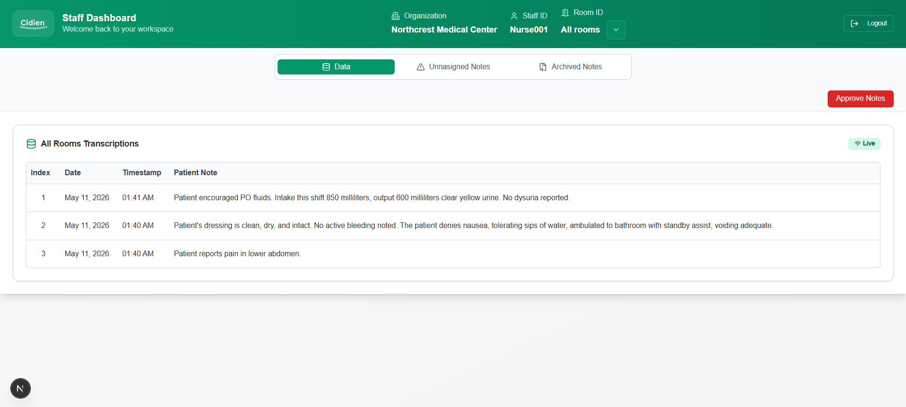

<p align="center">
  
</p>

<h1 align="center">Cidien</h1>
<p align="center">Charting Device for Nurses (CDN) - built to reduce charting friction and return time to patient care.</p>

<p align="center">
  
  
  
  
  
  
</p>

<p align="center">
  <a href="https://cidien.ca"></a>
</p>

## Why Cidien

Cidien was inspired by a real complaint from nurses, especially in Saskatchewan: charting takes too much time and energy away from direct patient care. Existing systems like Cerner can be powerful but often feel complex and hard to adopt in fast-moving clinical environments. Cidien simplifies this workflow by letting nurses capture room-based notes through a user-friendly interface while transcriptions appear live on a dashboard; it is still evolving, but it is a strong step toward reducing documentation burden.

## What Is Cidien

Cidien is a clinical charting workflow for nurses and care teams that combines mobile voice capture with real-time desktop review. It is designed for hospitals that need faster, clearer bedside documentation with less UI friction. The core value is simple: spend less time charting and more time caring.

## Demo Video / Screenshots

### Demo Video

<!-- TODO: Add demo video link or embed -->
_Add demo video here_

### Screenshots

<table>
  <tr>
    <td></td>
    <td></td>
    <td></td>
  </tr>
</table>

## How It Works

1. Admin sets up a hospital, rooms, and nurse assignments.
2. Nurse scans a generated QR code on their phone.
3. The desktop session transitions into the staff dashboard context.
4. Nurse dictates notes from mobile using the recording controls.
5. Notes appear in real time on the desktop dashboard for review.
6. Staff approves notes and generates a PDF chart/report.

## Tech Stack

| Technology | Purpose |
| --- | --- |
| Next.js | Frontend + server routes for the main web app |
| TypeScript | Type-safe application code |
| Supabase | Database, storage, and realtime signaling |
| Prisma | ORM and schema/migration workflow |
| OpenAI (`gpt-4o-mini-transcribe`) | Speech-to-text transcription |
| `pdf-lib` | Programmatic PDF generation |
| Vercel | Production hosting and deployment |

## Getting Started / Self-Hosting

### Prerequisites

- Node.js 18+ (LTS recommended)
- A Supabase project/account
- An OpenAI API key

### Clone and Install

```bash
git clone https://github.com/Jtsalam/Cidien.git
cd Cidien
npm install
```

### Environment Variables

Create a `.env.local` file in the project root. You can copy values from `.example.env`.

| Key | Description |
| --- | --- |
| `DATABASE_URL` | Prisma database connection string (pooled/direct as needed) |
| `DIRECT_URL` | Direct database connection string for migrations/introspection |
| `SUPABASE_SERVICE_ROLE_KEY` | Supabase service role key for privileged server operations |
| `NEXT_PUBLIC_SUPABASE_ANON_KEY` | Supabase anon key exposed to the client app |
| `NEXT_PUBLIC_SUPABASE_URL` | Supabase project URL |
| `NEXT_PUBLIC_BASE_URL` | Public app base URL (used for QR/mobile links) |
| `OPENAI_API_KEY` | OpenAI API key for transcription features |

### Database Setup

```bash
npx prisma migrate dev
```

### Run Locally

```bash
npm run dev
```

For mobile-device QR testing, expose your local app using ngrok:

```bash
ngrok http 3000
```

Then set `NEXT_PUBLIC_BASE_URL` to the ngrok HTTPS URL so your phone can reach your local environment over the internet.

## Project Structure

This is a shallow overview of the most important folders (derived from `fileOrganizationTree.txt`):

```text
app/          Next.js app router pages, layouts, and API routes
components/   Reusable UI and feature components (landing, demo, staff/admin views)
lib/          Core app utilities, realtime helpers, Prisma client, PDF/transcription logic
prisma/       Prisma schema and database migrations
public/       Static assets (logo, images, docs, screenshot targets)
references/   Design/reference notes used during UI iterations
```

## Contributing

Contributions are welcome. Fork the repository, create a feature branch, and open a pull request with a clear description of your changes. Small, focused PRs are preferred.

Happy Coding :)
~Tobi

## License

MIT License
